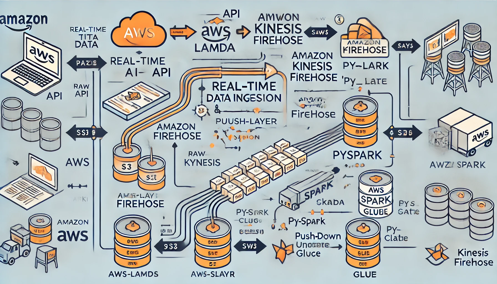
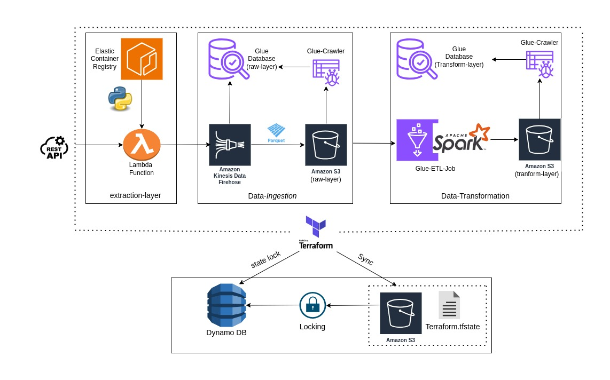
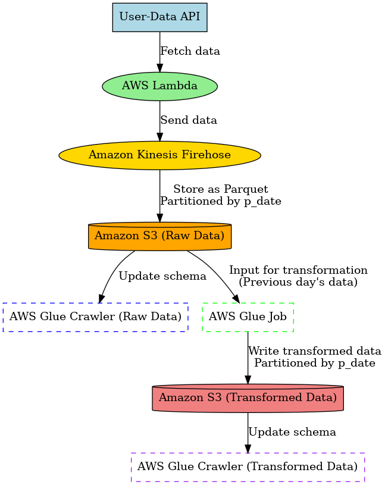

# AWS Real-Time Data And Transformation Pipeline

```sh
By: Varun Sharma
```
This repository contains the implementation of a real-time data ingestion and transformation pipeline, designed to handle and process user data from an external API. The pipeline leverages **AWS Services** and **Terraform** for infrastructure automation, enabling scalability, maintainability, and efficiency.



## Architecture Diagram


## Overview
The project involves the following stages:

<u>**1. Data Ingestion**</u>
- **AWS Lambda Function:** A Lambda function, containerized with Docker and hosted on Amazon ECR, fetches data from the user-data-api and sends it to Amazon Kinesis Firehose.
- **Kinesis Firehose:** Configured to convert incoming data into Parquet format and partition it in an S3 bucket by the p_date key (representing the ingestion date). Firehose is integrated with an AWS Glue database and table for schema management.

<u>**2. Partition Management**</u>
- **AWS Glue Crawler:** A crawler updates the schema in the user-data-raw-layer Glue database and table with new partitions added to the S3 bucket.

<u>**3. Data Transformation**</u>
- **PySpark-Based Glue Job:** A Glue job performs transformations on the data according to the defined data model. It uses a push-down predicate to fetch data from the previous day's partition (p_date) for processing and writes transformed data to the user-data-transform-layer in S3, partitioned by the p_date key.
- **Transform Layer Crawler**: A separate crawler updates the Glue database and table for the transformed data layer.

<u>**4. Access and Security**</u>
- IAM Roles: Precise IAM roles are configured for all AWS resources to ensure seamless and secure inter-service communication.

<u>**5. Infrastructure Automation**</u>
- The entire infrastructure is provisioned and managed using **Terraform**, ensuring consistency, repeatability, and ease of deployment.

## Features
- **Real-Time Data Processing:** Enables real-time data ingestion from an external API to an AWS-based data lake.
- **Partitioned Data Storage:** Efficient partitioning of data in S3 by ingestion date (p_date).
- **Automated Schema Updates:** AWS Glue Crawlers update the schema dynamically for both raw and transformed data layers.
- **Scalable Transformation:** Uses PySpark Glue jobs for scalable and efficient data transformation.
- **Secure Infrastructure:** Fine-grained IAM policies for secure resource access.
- **Infrastructure as Code (IaC):** Entire solution automated using Terraform for quick deployment and management.

## Data Flow


## Prerequisites
- AWS CLI installed and configured.
- Terraform installed.
- Docker for building Lambda container images.
- Access to an AWS account with sufficient permissions for creating resources.

## Setup Instructions
**1. Clone Repository**
```sh
git clone <repository-url>
cd <repository-directory>
```
**2. Configure Terraform**
- Update the AWS Configure with the required parameters like access key, secret access key, region.
- Initialize Terraform:
```sh
terraform init
```
- See the overview of the resources which will be deployed in the AWS account in Terraform action plan
```sh
terraform plan
```
- Apply the Terraform configurations i.e. deploy the resources in the AWS account
```sh
terraform apply
```
**3. Verify Resources:**
Ensure all resources (ECR repo, Lambda, Firehose, Glue Crawlers, Glue Jobs, S3 buckets, IAM roles) are correctly provisioned.

## Usage
<u>**1. Lambda Function Execution:**</u>

- The Lambda function is triggered using Amazon EventBridge with a trigger rate of one minute to fetch data from the API continuously.

<u>**2. Data Flow Monitoring**</u>

- Monitor the data flow from Lambda to Amazon Kinesis Firehose, which processes the incoming data and stores it in the raw data layer of the S3 bucket.

<u>**3. Raw Data Schema Updates**</u>

- The raw-layer crawler is scheduled to run daily at 1:00 AM. It updates the schema and partitions in the Glue database for the raw data stored in S3.

<u>**4. Data Transformation**</u>

- The AWS Glue job is triggered daily at 1:30 AM. It uses a push-down predicate to fetch data from the previous day's partition in the raw layer, performs transformations as per the data model, and writes the transformed data to the user-data-transform-layer in the S3 bucket.

<u>**5. Transformed Data Schema Updates**</u>

- The transform-layer crawler is scheduled to run daily at 2:00 AM. It updates the schema and partitions in the Glue database for the transformed data stored in S3.

<u>**6. Validation and Monitoring**</u>

- Verify the transformed data in the S3 bucket under the user-data-transform-layer.
- Ensure schema updates for both raw and transformed data are accurately reflected in the Glue database.


